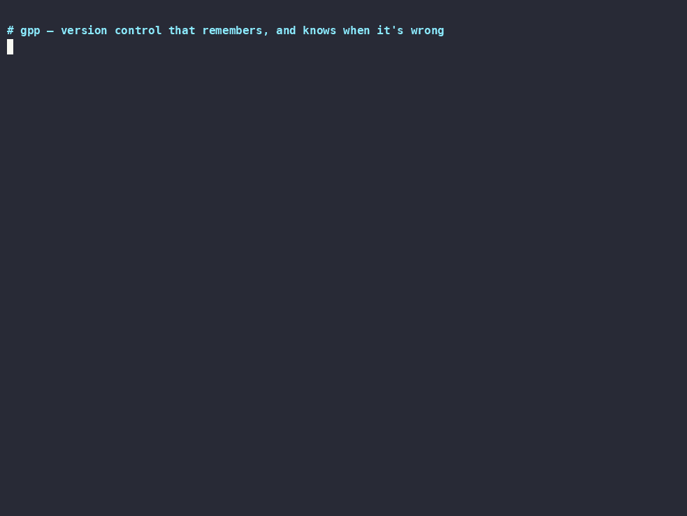

# gpp (git++)

[](https://github.com/mahabubul470/gpp/actions/workflows/ci.yml)
[](LICENSE)
[](rust-toolchain.toml)

AI agents change code continuously, then lose the work that happened
between commits — and the notes they keep about your codebase
(`CLAUDE.md`, memory banks, knowledge files) go stale silently when the
code moves on. gpp is a version control system built for that reality: it
**captures every change as it happens**, promotes curated changesets with
intent and provenance, and hosts project knowledge **on the repo's own
history** — so when a commit invalidates something you believed about the
code, gpp can name that commit.



*(Recording is generated by [`scripts/demo.sh`](scripts/demo.sh) —
deterministic, reproducible, no mockups.)*

## 30-second try

```bash
cargo install --git https://github.com/mahabubul470/gpp gpp-cli

gpp init --graphex
echo "fn main() {}" > main.rs
gpp timeline                     # captured already — no staging, no commit
gpp promote -m "first cut" --intent feature
gpp diff HEAD                    # semantic diff: renames/moves are one op
```

And the part no other VCS does — record what you believe about the code,
and let history police it:

```bash
gpp belief add --claim "token expiry is 24h" --evidence src/auth.rs:7-7
# ...weeks of commits later...
gpp belief bisect "token expiry is 24h"
# INVALIDATED  cs:fhcpef7c  "raise token expiry to 7 days"
#  -     7 | pub const EXPIRY_HOURS: u64 = 24;
#  +     7 | pub const EXPIRY_HOURS: u64 = 168;
```

Deterministic — diff intersection and blob hashes, zero LLM or network
calls. See [`demos/belief-bisect/`](demos/belief-bisect/) for the full
walkthrough, including validation against axum's real 0.6→0.7 history.

## What makes it different

- **Continuous capture.** A high-frequency timeline records every file
  change (SQLite WAL, debounced watcher); curated changesets are
  *promoted* from it with an explicit intent, author kind (human/agent),
  and cost record. Nothing is lost between commits.
- **Graphex: versioned, encrypted project knowledge.** Architecture,
  conventions, decisions, and *beliefs* live in an encrypted knowledge
  graph inside the repo, tier-gated per agent trust level, audited on
  every read — and staleness-checked against the history it rides on.
- **Agent governance.** First-class agent identity with reputation
  scoring, compliance-as-code policies enforced at capture/promote/sync,
  anomaly detection, and per-changeset token/cost attribution.

Everything else — P2P sync over Noise, replay, review/RBAC, a relay node,
a TUI — is the platform underneath: see
[`docs/ARCHITECTURE.md`](docs/ARCHITECTURE.md).

**Git is the substrate, not the competition.** The bridge
(`gpp git-import` / `git-export` / `git-bridge`) round-trips real Git
commits, so GitHub and existing workflows keep working — gpp's knowledge,
provenance, and governance layers ride alongside. The axum demo above
runs entirely on history imported through this bridge.

## Connect Claude Code (or any MCP client)

gpp ships an MCP server; agents query the knowledge graph (with staleness
flags), propose changesets, and report costs. Drop this in `.mcp.json` at
your repo root:

```json
{
  "mcpServers": {
    "gpp": { "command": "gpp", "args": ["mcp-server", "--stdio"] }
  }
}
```

Full client setup (Claude Desktop, generic stdio) and the exposed tool
list: [`docs/MCP.md`](docs/MCP.md).

## Status

**All 9 roadmap phases (0–8) implemented.** See
[`docs/ROADMAP.md`](docs/ROADMAP.md) for per-phase deliverables and
documented deviations, [`docs/TODO.md`](docs/TODO.md) for the prioritized
backlog, and [`docs/WORKLOG.md`](docs/WORKLOG.md) for the running
engineering log.

Verified 2026-07-12: **177 workspace tests pass**, `cargo clippy` and
`cargo fmt` clean, full workspace builds. No stub crates remain — every
crate has a working implementation. Coverage is measured in CI
(`cargo llvm-cov`; 65.7% line at baseline, being raised).

Test depth is still **uneven**: foundational layers are well covered
(`gpp-core`, `gpp-graphex`, `gpp-diff`, `gpp-tui` ≥ 80% line; the CLI has
end-to-end suites for policy enforcement, cost reporting, reviewer
assignment and belief bisect), while several integration crates remain at
smoke-level (`gpp-sdk`, `gpp-notify`, `gpp-rbac`, `gpp-replay`).
"Implemented" here means *built and tested against its milestone*, not
*exhaustively hardened* everywhere. Closing that gap is the top item in
[`docs/TODO.md`](docs/TODO.md).

## The full layer table

| Layer | Crate | What's implemented |
|---|---|---|
| Storage | `gpp-core` | Content-addressed store (BLAKE3 + zstd), `Blob`/`Tree`, raw verified frame transfer |
| Timeline | `gpp-timeline` | SQLite (WAL) capture, `.gppignore`, debounced watcher, pruning |
| History | `gpp-history` | `Changeset`/`Intent`/`Author`, branch refs, promote, DAG walk |
| Diff | `gpp-diff` | Line + **tree-sitter semantic** diff (Rust/Python/TS/Go), rename/move detection |
| Git bridge | `gpp-git-bridge` | `git-import`/`git-export`/`git-bridge`, SQLite hash map |
| Graphex | `gpp-graphex` | Encrypted (age + AES-GCM) knowledge graph, tier-gated projection, query, lifecycle, audit, **beliefs + staleness engine** |
| SDK / MCP | `gpp-sdk` | `AgentSession`; `gpp mcp-server --stdio` (JSON-RPC MCP) |
| Trust | `gpp-trust` | Reputation scoring, status transitions, overrides, events |
| Policy | `gpp-policy` | `.policy` TOML rules, enforcement at promote (block) + timeline (warn) + sync (block), built-in templates |
| Cost | `gpp-cost` | Per-changeset token/$ records, budgets, efficiency, agent self-reporting |
| Anomaly | `gpp-anomaly` | Scope/burst/size detection, resolution workflow |
| Sync | `gpp-sync` | Noise_XX P2P; objects/refs/policies/graphex; fork-preserve |
| Replay | `gpp-replay` | Reproducible environment snapshots + drift diff |
| Review/RBAC/Notify | `gpp-review` `gpp-rbac` `gpp-notify` | Review lifecycle, roles + branch protection, events/inbox/HMAC webhooks |
| Remote | `gpp-remote` | GitHub/GitLab/Bitbucket PR creation, enriched bodies, CI/review import |
| Relay | `gpp-relay` | Always-on sync hub binary + health endpoint + Dockerfile |
| Clients | `gpp-cli` `gpp-tui` `gpp-deps` | Full CLI, ratatui TUI (`gpp ui`), dependency intel (`gpp deps` + OSV) |

Also: `extensions/{gh-gpp,vscode-gpp,neovim-gpp}`, GitHub Actions +
GitLab CI templates, `deploy/` Docker images, `packaging/` Homebrew.

Documented follow-ups (recorded in the ROADMAP/TODO, not silently
skipped): registry/license APIs for deps, native PyO3/napi bindings,
outbound platform-review sync, apt/dpkg packages.

## Install / build

```bash
cargo install --git https://github.com/mahabubul470/gpp gpp-cli     # the `gpp` binary
cargo install --git https://github.com/mahabubul470/gpp gpp-relay   # relay node (optional)

# or from a clone
cargo build --release
cargo test --workspace
cargo bench -p gpp-core -p gpp-diff      # criterion perf suite
```

## More to try

```bash
# Governance
gpp policy template secrets-scan
gpp trust show
gpp audit --include-cost --include-graphex

# Decentralized: sync two repos over Noise
gpp sync serve 127.0.0.1:9473             # on peer A
gpp sync add a 127.0.0.1:9473 && gpp sync # on peer B

# GitHub-compatible
gpp remote setup --platform github --repository acme/webapp
gpp remote pr-create --base main
```

See [`CLAUDE.md`](CLAUDE.md) for project context, [`docs/`](docs/) for the
full specification (architecture, data model, CLI, protocols, roadmap),
and [`docs/book/`](docs/book/) for the user guide + tutorials.

## License

[MIT](LICENSE)
